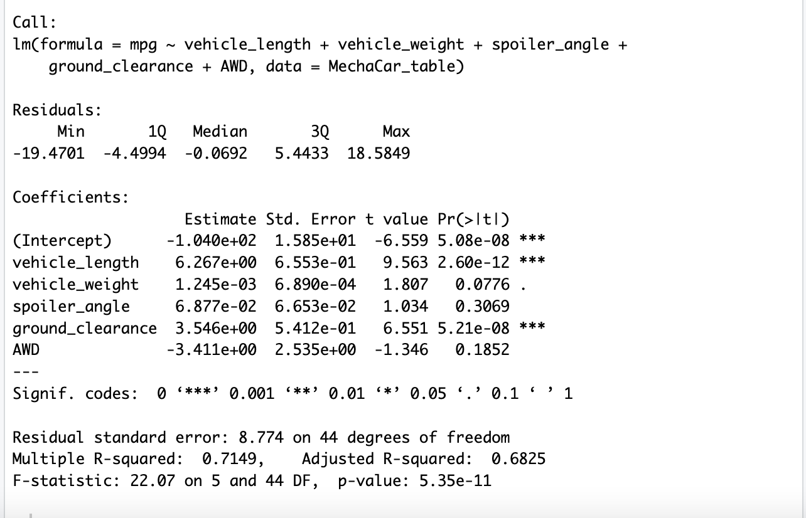
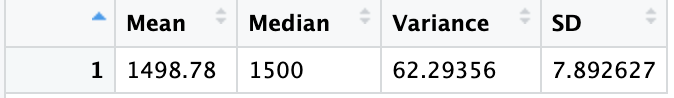
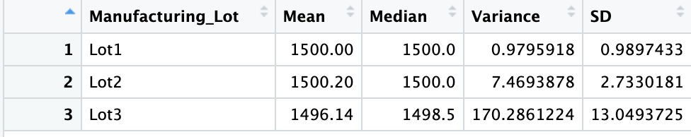
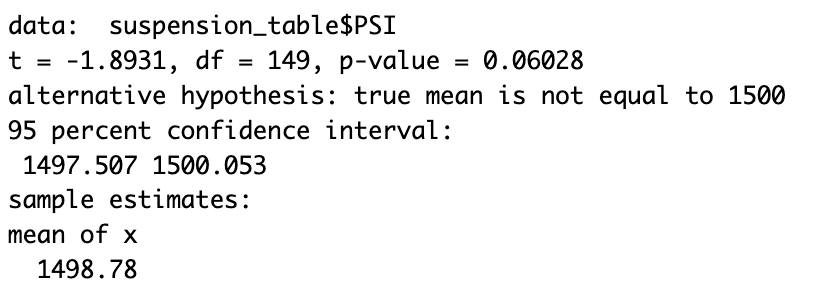
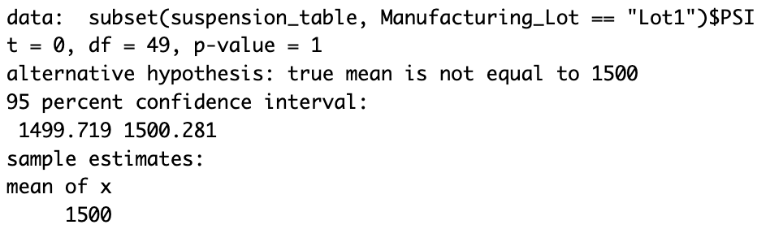
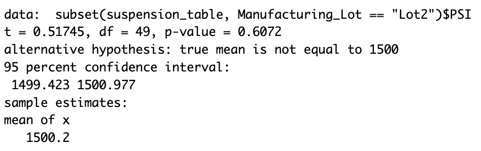
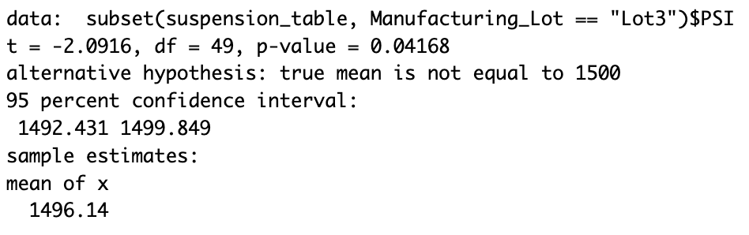

# Car_Manufacturing_Statistical_Analysis

## Linear Regression to Predict MPG
The below statistics describe the results of this analysis.

Looking at the "Pr(>|t|)" column in the Coefficients table above, we can see that intercept, vehicle length, and ground clearance are unlikely to provided a non-random amount of variance to the mpg values in the dataset. These coefficients are well below our assumed significance level of 0.05. 

The p-value of this linear regression model, represented on the bottom line of the image, is 5.35e-11, much smaller than our assumed significance level of 0.05. Therefore, it can be stated that the slope of the linear model is not zero. The null hypothesis may be rejected. 

According to the Multiple R-Squared value located on the second line of the above image, roughly 70% of all mpg predictions made using this model will be correct. It can be said that this model is more than 50% effective at predicting mpg. This may be effective for some applications. For other applications that require a higher level of reliability, 70% might not be good enough. Additionally, it should be consider that because the intercept coefficient is significant in this analysis, there may be other variables and factors contributing to mpg that are not consider in this analysis. 

## Summary Statistics on Suspension Coils
### Total Summary Table

The table above summarizes PSI data on suspension coils from the total of all manufacturing lots. As the number in the "Variance" Column shows, the total PSI variance is less than 100, meeting design specifications.

### Lot Summary Table

The table above summarizes PSI data on suspension coils from each of the manufacturing lots. Looking at the "Variance" column, we can see that the variance data taken from Lots 1 and 2 are very low, well under the design specification maximum of 100. The data from Lot 3, however, is slightly over 170, well outside of the design specification maximum of 100. Lot 3 does not meet design specifications.

It appears that the low variance numbers from Lots 1 and 2 are keeping the variance from the Total Summary Table below 100, within design specifications, even thought Lot 3 is not meeting design specifications

## T-Tests on Suspension Coils
### All Lots

The above results from the T-Test run all data from all manufacturing lots shows a calculated p-value of 0.06028. This is above our significance level of 0.05, meaning that the PSI across all manufacturing lots is statistically similar to the population mean of 1,500. 

### Lot 1

The above results from the T-Test run on data from Manufacturing Lot 1 shows a calculated p-value of 1. This is well above our significance level of 0.05, meaning that the PSI at Lot 1 is statistically similar to the population mean of 1,500.

### Lot 2

The above results from the T-Test run on data from Manufacturing Lot 2 shows a calculated p-value of 0.6072. This is well above our significance level of 0.05, meaning that the PSI at Lot 2 is statistically similar to the population mean of 1,500.

### Lot 3

The above results from the T-Test run on data from Manufacturing Lot 3 shows a calculated p-value of 0.04168. This is below our significance level of 0.05, meaning that the PSI at Lot 3 is statistically different form the population mean of 1,500.

### Summary
Although the PSI at Lot 3 is statistically different from the population mean, Lots 1 and 2 are similar enough to the population mean to pull the combined data from all lots close enough to the population mean to say that Lots 1, 2, and 3 as a group are statistically similar to the population mean. 

